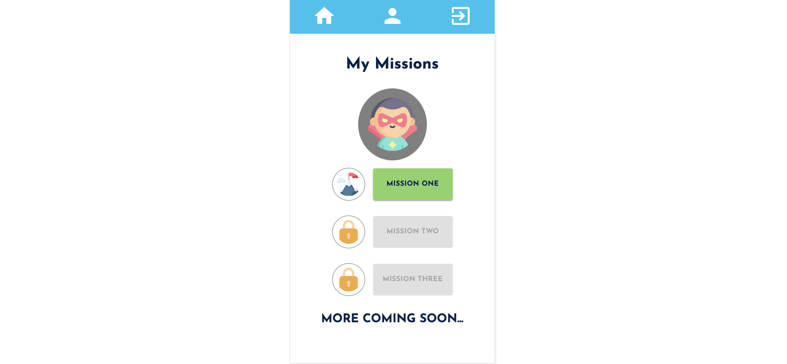

<!-- omit in toc -->
# My FAC19 journey

[Founders and Coders](https://foundersandcoders.com/) is a highly selective 18-week full-stack Javascript development bootcamp in London. It is peer-led and project-based, entirely done pair-programming. 

To apply I needed to complete a list of [prerequisites](https://github.com/glrta/glrta-portfolio-fac#application-prerequisites). After submission, I was invited for an interview and then finally offered a place at the 2020 spring cohort 🎉, that ran from March to June 2020.

💁‍♀️ My [application](http://glrta.github.io/fac19-application) website built as part of the prerequisites. 

➗ [Calculator](https://github.com/glrta/calc) built as a pre-course project for FAC19.

<!-- omit in toc -->
## First half

During the first 9 weeks of the programme is focused on JavaScript stack fundamentals. Each week we are introduced to a new topic and tasked with a project, user stories and accentance criteria focused on the week's topic.  An MVP is built in 1.5 days by 4 developers that follow the Agile methodology. The course material is all open source and available [here](https://founders-and-coders.gitbook.io/coursebook/).

<!-- omit in toc -->
### Topics and projects

- [Week 1: Version Control](#week-1-version-control)
- [Week 2: HTTP](#week-2-http)
- [Week 3: Testing](#week-3-testing)
- [Week 4: Node.js](#week-4-nodejs)
- [Week 5: Database (PostgreSQL)](#week-5-database-postgresql)
- [Week 6: Authentication](#week-6-authentication)
- [Week 7: Rest API](#week-7-rest-api)
- [Week 8: Full-stack App](#week-8-full-stack-app)
- [Week 10: React](#week-10-react)

<!-- omit in toc -->
## Second half

The second half of the course is focused on two projects addressing a specific real-world problem: one student project and one client project as part of the [Tech for Better](https://www.foundersandcoders.com/tech-for-better/) programme. Both are build from concept to deliver over one design week and two one-week build sprints.

**1. Student project: :clapper: Bechdel and Beyond**

- Created a community-driven app that allows users to rate and find films based on gender representation on screens and behind the scenes.
- My role: as QA lead I ensured the API and the client side had over 90% test coverage and that user journeys were tested end-to-end with Cypress.
- Tech used : Node.js | Express | PostgreSQL | React | Material UI | Jest | Tape | Cypress | Travis | Codecov

Learn more: [API](https://github.com/fac19/Bechdel-Beyond-backend), [FE](https://github.com/fac19/Bechdel-Beyond) and live [website](https://bechdelbeyond.netlify.app).

**2. Client project: :rocket: Enterprise Adventure**

- Developed a React + Netlify + Airtable concept app for the non-profit Teach a Man to Fish, whose mission is to empower young people in Asia, Africa and Latin America with skills to succeed in school, work and life.
- My role: as UX\UI lead I coordinated user testing, revised product design and ensured accessibility.
- Tech used : React | Style Components | Material UI | Jest | Codecov |  Netlify dev | Airtable

Learn more: [FE](https://github.com/fac19/teach-fish-frontend) code and live [website](https://enterprise-adventure.netlify.app).

:purple_heart: Thank you for reading! :purple_heart:

---

### Week 1: Version Control

- [Week schedule](https://founders-and-coders.gitbook.io/coursebook/curriculum/teamwork-and-toolkit)
- Learning outcomes: pair-programming techniques, version control git/GitHub :octocat:, accessibility, responsive design and grid layout.
- Team project: Digital Agency responsive and accessible website [repo](https://github.com/glrta/week1-hklo).
- Team: Gio, Hannah, Tom and James.

### Week 2: HTTP

- [Week schedule](https://founders-and-coders.gitbook.io/coursebook/curriculum/http/schedule)
- Learning outcomes: Asynchronicity, fetch, layout and spacing, developer tools.
- Team project: Movie Mashup [repo](https://github.com/glrta/week2-hklo). Movie mash-up is a game where the user is given a randomised GIF and has to select the correct movie out of 4 randomised choices that are displayed on the page.
- Team: Gio, Hannah, Tom and James.

### Week 3: Testing

- [Week schedule](https://founders-and-coders.gitbook.io/coursebook/curriculum/testing/schedule)
- Learning outcomes: TDD, integration test, scope, colour palette and accessibility.
- Team project: to-do list website [repo](https://fac19.github.io/week3-JICG/).
- Team: Gio, Chloe, Jack and Ivo.
  

### Week 4: Node.js

- [Week schedule](https://founders-and-coders.gitbook.io/coursebook/curriculum/node/schedule)
- Learning outcomes: create a web server, handle requests, core Node modules, testing using third party libraries. 
- Team project: Microblog [repo](https://serene-peak-45045.herokuapp.com).
- Team: Gio, Chloe, Jack and Ivo.

### Week 5: Database (PostgreSQL)

- [Week schedule](https://founders-and-coders.gitbook.io/coursebook/curriculum/databases/schedule)
- Learning outcomes: SQL, Postgres, PSQL, database in Node, testing database, software architecture.
- Team project: Blog style website where users can post surplus items for other users to collect. [Repo](https://github.com/fac19/week5-FKAM).
- Team: Gio, Joe, Ina and Roger.

### Week 6: Authentication

- [Week schedule](https://founders-and-coders.gitbook.io/coursebook/curriculum/authentication/schedule)
- Learning outcomes: password encryption, JWT (JSON Web Tokens), promises
- Team project: Blog website with authentication. [Repo](https://github.com/glrta/week6-BGJK).
- Team: Gio, Cammy, Liz and Vatsal.

### Week 7: Rest API

- [Week schedule](https://founders-and-coders.gitbook.io/coursebook/curriculum/rest-apis/schedule)
- Learning outcomes: API that handles GET, POST, PUT and DELETE methods, Express, Express middleware, Postman.
- Team project: Rest API with FAC19 icebreker questions and answers. [Repo](https://github.com/glrta/week7-BGJK).
- Team: Gio, Cammy, Liz and Vatsal.

### Week 8: Full-stack App

- [Week schedule](https://founders-and-coders.gitbook.io/coursebook/curriculum/fullstack-app/schedule)
- Learning outcomes: single page app, client side routing, fetch, error handling. 
- Team project: website to share your love for dogs. [Repo](https://github.com/glrta/week8-DEKN).
- Team: Gio, Hettie, Ako and Kat.

### Week 10: React

- [Week schedule](https://founders-and-coders.gitbook.io/coursebook/curriculum/react/schedule)
- Learning outcomes: useState, useEffect, components, JSX, testing React components, modularising frontend code.
- Team project: Pokemon game. Gotta catch them all! [Repo](https://github.com/fac19/week10-gv).
- Team: Gio and Vatsal.
